## Project 2 – Scalability

## Goals

### Load testing

- Measure application behaviour and throughput by increasing the load with tools like Apache Jmeter
- Make plots of the metrics obtained and find ways to improve system's effeciency

  #### Load Test plan
  - Hardware resource usage estimation
  - Number of users
  - Expected throughout at each microservice
  - Estimated usage of resources

Scalability

- Understand the fault tolerance of the application
- Deploy the application with Kubernetes cluster in the Jetstream VM
- Determine the performance of the application by scaling with different replications.

## Design Plan

## Kubernetes

- Minikube cluster is used to deploy scale each of the microservices. The application was tested for various amounts of load with Apache Jmeter. 

## Pre-requisites

- Minikube cluster with kubectl installed and configured to use your cluster
- Docker cli installed, you must be signed into your Docker Hub account

## Setup

- Run the following command deploy the application in the kubernetes cluster

                kubectl apply -f kubernetes/. --recursive

- To manually scale the application to 3 replicas run the following script file with -r as 3

                sh kube-scale.sh -r 3

---
## Jmeter 

### Load Test Plan

Using Jmeter, we have tested our application for the following configurations and compared the results.

- 100 requests (10 threads x 10 requests)
- 250 requests (25 threads x 10 requests)
- 500 requests (50 threads x 10 requests)

Standard Implementation Results (Replication Factor - x1 ) –
- 100 requests (10 threads x 10 requests)

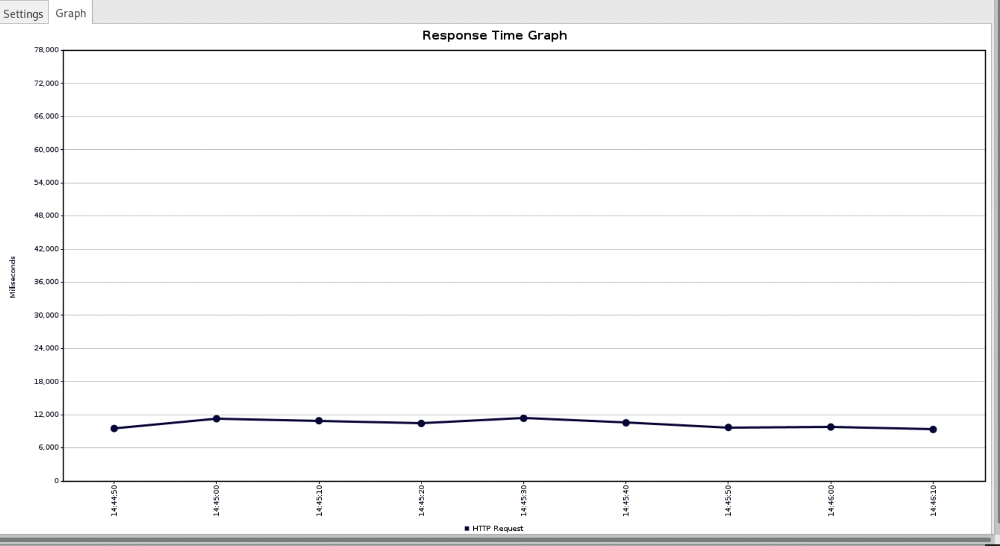

In this test, the application response time was in the range of 6-10s, which is acceptable and will serve as a benchmark response time for our application as we increase the load.

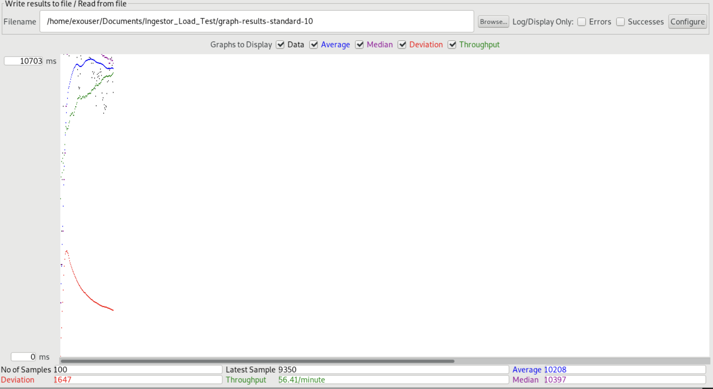

In this test, the application was able to serve an average of 56 requests/min.

- 250 requests (25 threads x 10 requests each)

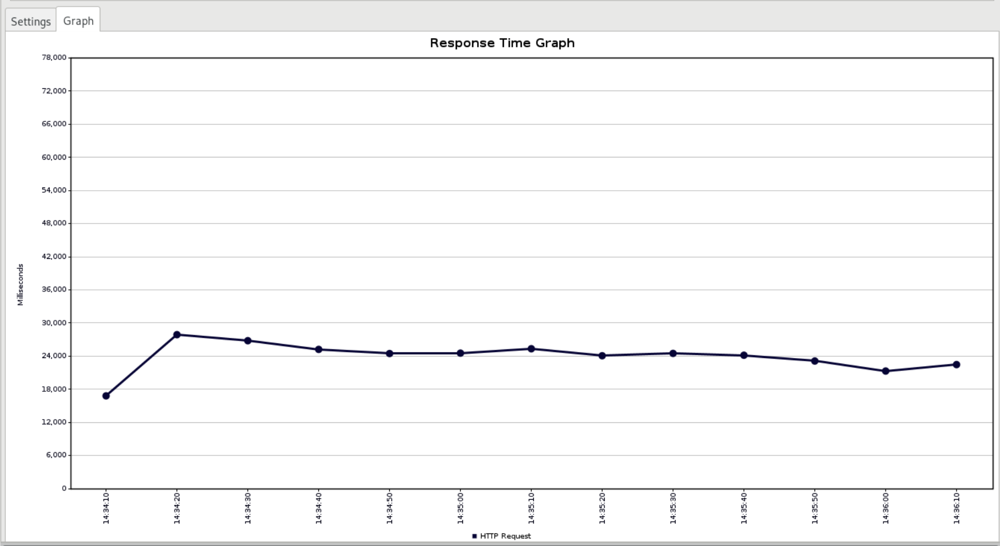

For 25 threads i.e. 25 concurrent users, the response time increased to 24-30 seconds, which is unacceptable considering our benchmark response time of 6-10 seconds.

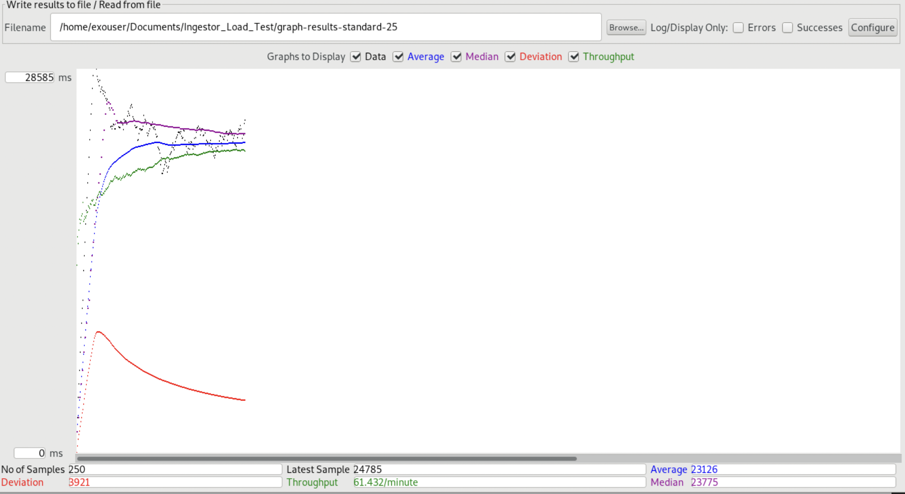

The throughput increased slightly to 61 requests/min, which is due to the increase in incoming requests. 

- 500 requests (50 threads x 10 requests)

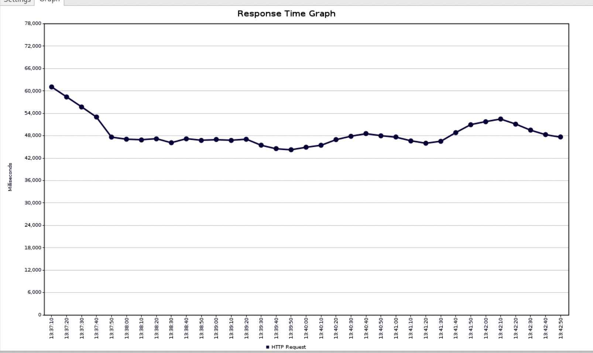

For 50 threads i.e. 50 concurrent users, the response time increased to 60 seconds, indicating a failed test.

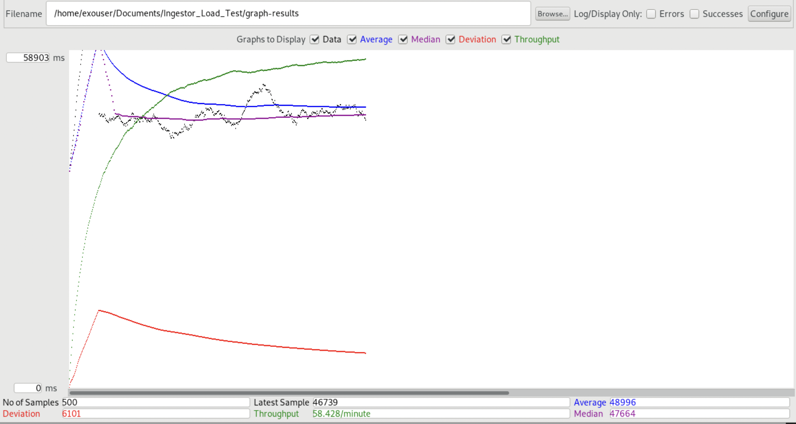

The throughput for this test was 56 requests/min.

### Results Summary for Load Test on Standard Implementation

- Valid Response Time for application - 6-10s
- Application can withstand upto 10 concurrent users making 10 requests each and keep the response time under 10s for each request.
- The performance starts to deteriorate as the load is increased above 10 threads, resulting in significant increase in response times.

 ### Results with 3x Scaled Services - 

- 100 requests (10 threads x 10 requests)

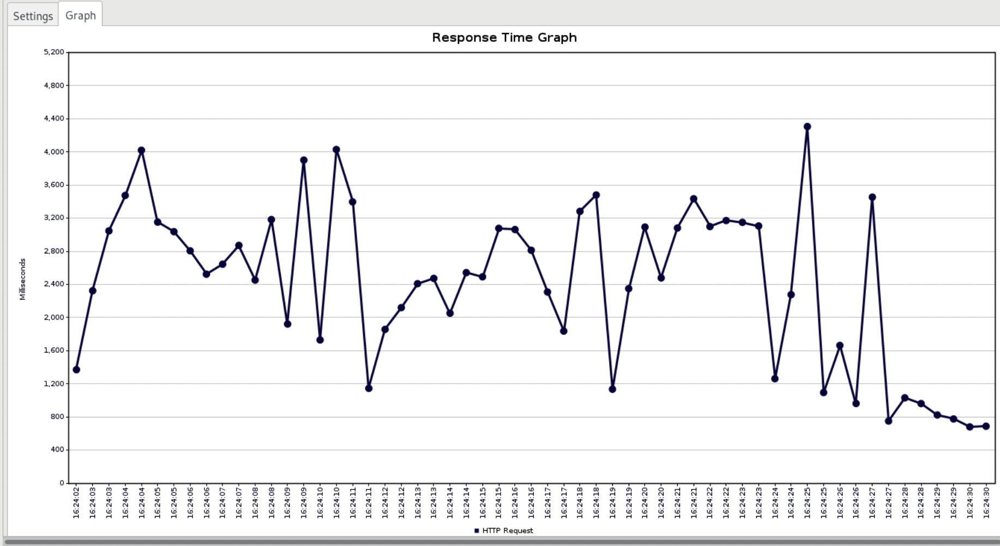

When the services are scaled to 3x, the response time improves considerably to 1-4 seconds, which is well under our defined benchmark response time.

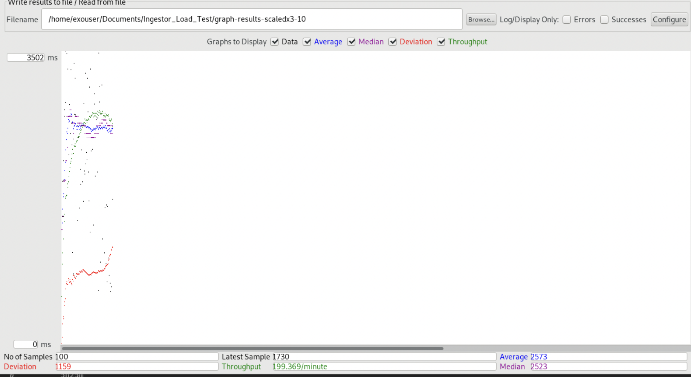

After scaling to 3x, the application was able to serve 200 requests/min.

- 250 requests (25 threads x 10 requests)

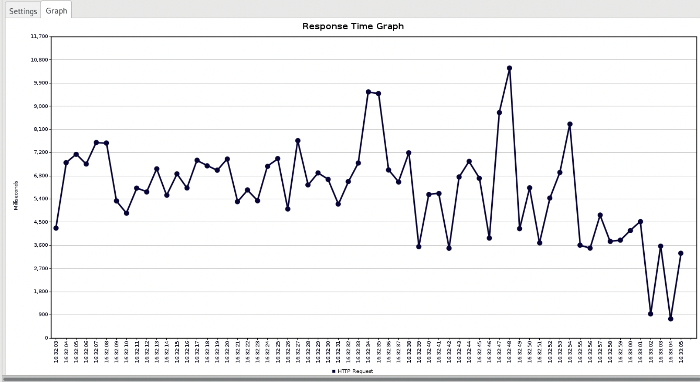

After scaling to 3x, the application can handle 25 concurrent users and send response back in under 8 seconds for majority of the 250 requests.

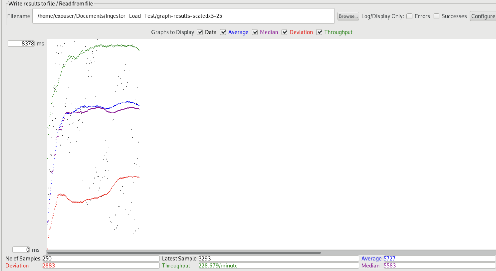

Throughput for this test - 226 requests/min

- 500 requests (50 threads x 10 requests)

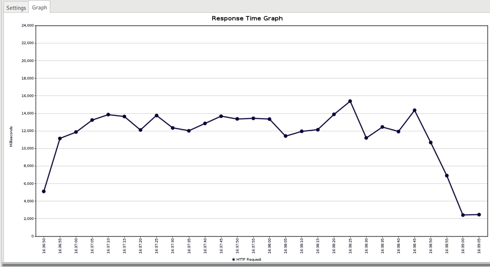

Increasing requests to 500, the application response time increased to 12-14 seconds, which is worse than our defined benchmark of 6-10 seconds, so our application failed this test.

### Results with 5x scaled

- 500 requests (50 threads x 10 requests)

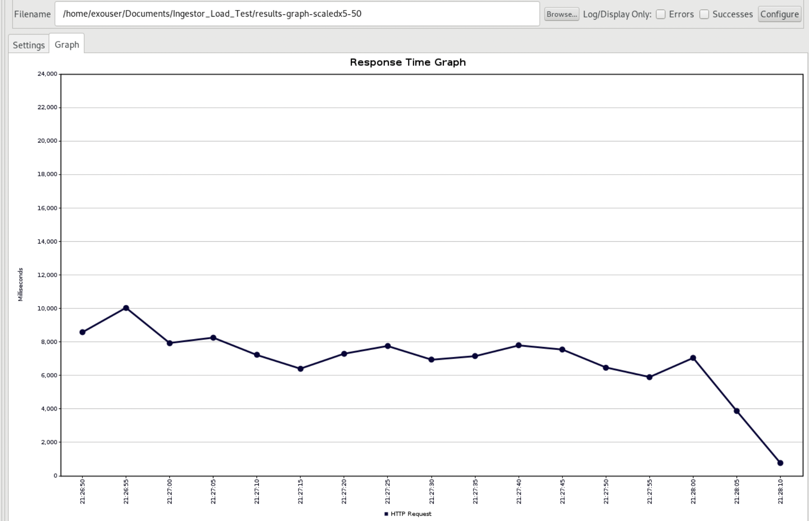

Once scaled to 5x, the application was able to handle 50 concurrent users, and keep the response time for each request under 10 seconds. 

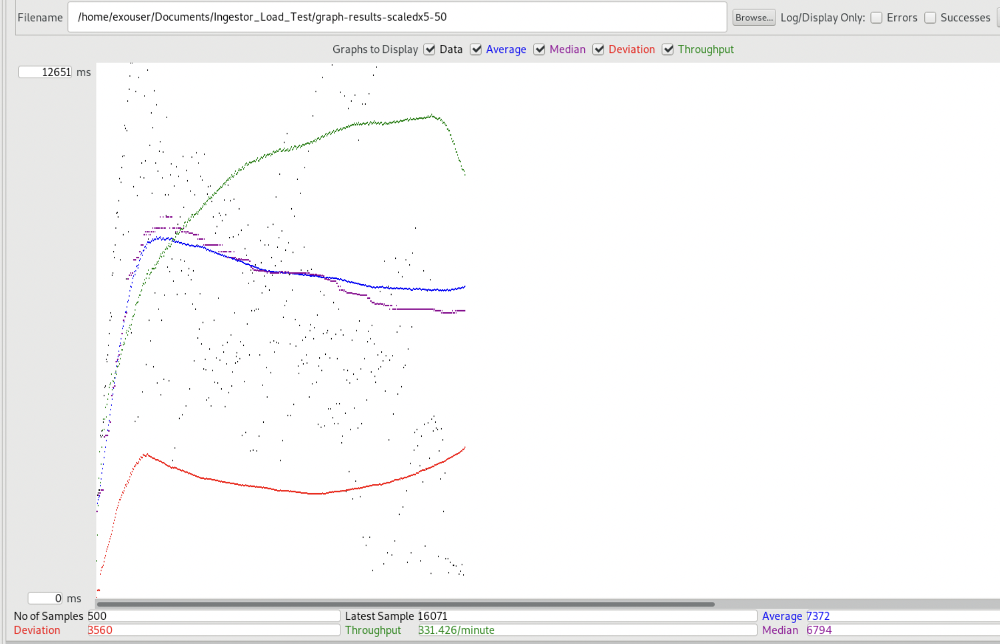

The throughput increased considerably to 330 requests/min.

### Spike Testing Results

For Spike Testing using Jmeter, we used the custom thread group plugin, to create a spike of requests to spike test the application. The request configuration we used is shown below - 

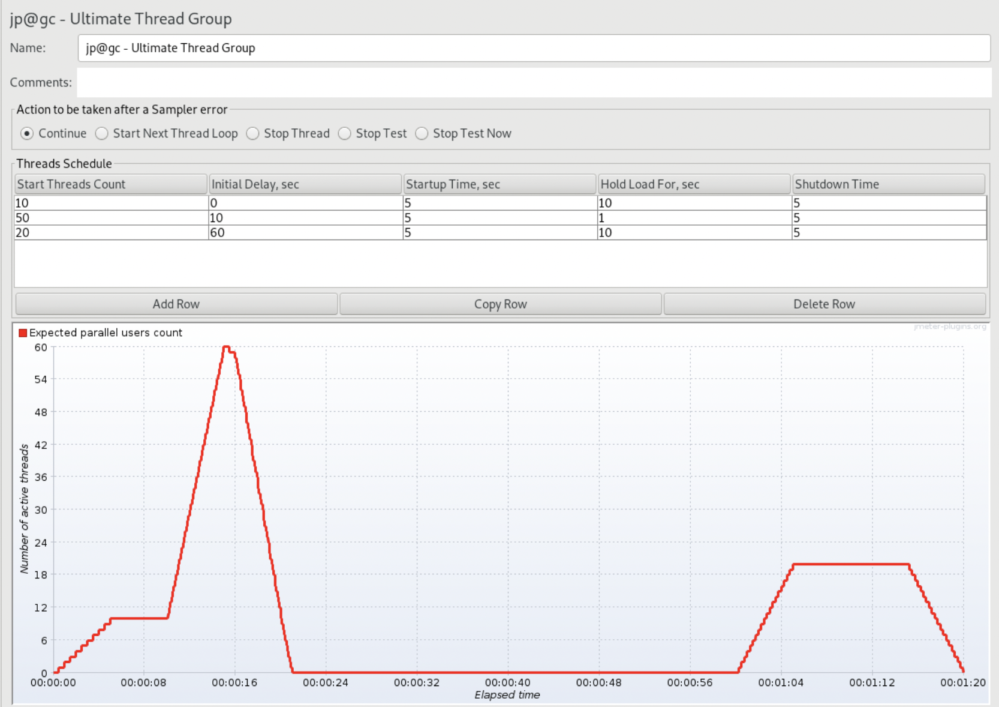

### Test on 1x scaled implementation

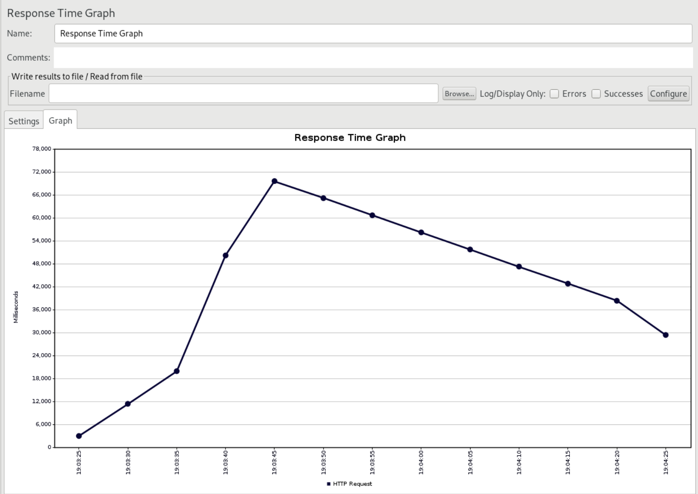

Response time graph for spike test with response time in request spike reaching 70 seconds.

### Test on 5x scaled implementation

Once scaled to 5x, the application was able to handle the spike of 50 concurrent users, and keep the response time around 8-10 seconds.

### Final Summarized Results

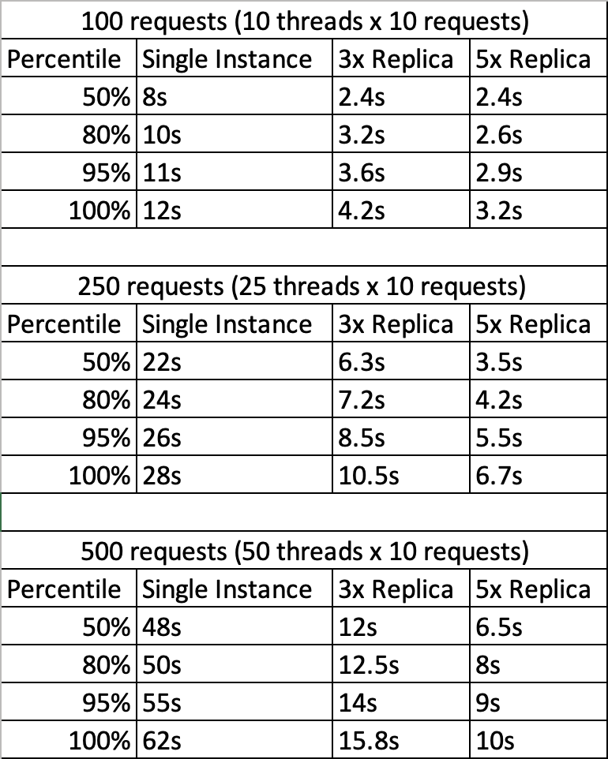

